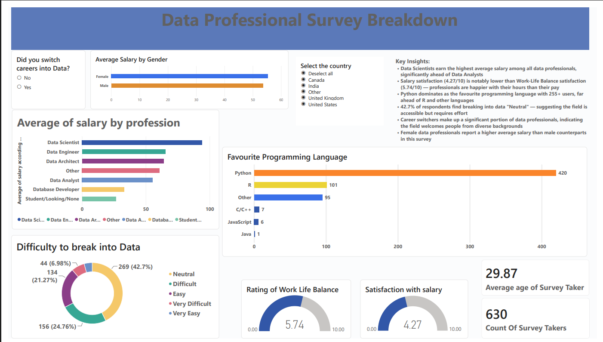

# Data Professional Survey Breakdown

## Overview
This project analyzes survey responses from 630 data professionals worldwide to uncover salary trends, job satisfaction levels, programming language preferences, and career transition patterns using Power BI.

## Tools Used
- Power BI
- Power Query
- DAX
- Excel

## Dataset
- **Source:** Alex The Analyst (Data Professional Survey)
- **Respondents:** 630
- **Collected:** June 2022

## Objective
To analyze and visualize key trends among data professionals including salary distribution, satisfaction levels, preferred tools, and difficulty of breaking into the data field.

## Key Findings
- Data Scientists earn the highest average salary among all data professionals, significantly ahead of Data Analysts
- Salary satisfaction (4.27/10) is notably lower than Work-Life Balance satisfaction (5.74/10) — professionals are happier with their hours than their pay
- Python dominates as the favourite programming language with 420 users, far ahead of R (101) and others
- 42.7% of respondents find breaking into data "Neutral" in difficulty — suggesting the field is accessible but requires effort
- Career switchers make up a significant portion of data professionals, indicating the field welcomes people from diverse backgrounds
- Surprisingly, female data professionals report a higher average salary than male counterparts in this dataset — contrary to general market trends

## Dashboard Features
- Interactive country slicer to filter all visuals by region
- Career switcher filter (Yes/No)
- Average salary breakdown by job title and gender
- Favourite programming language analysis
- Difficulty to break into data breakdown
- Work-Life Balance and Salary satisfaction gauges (scale 0-10)

## Dashboard Preview
